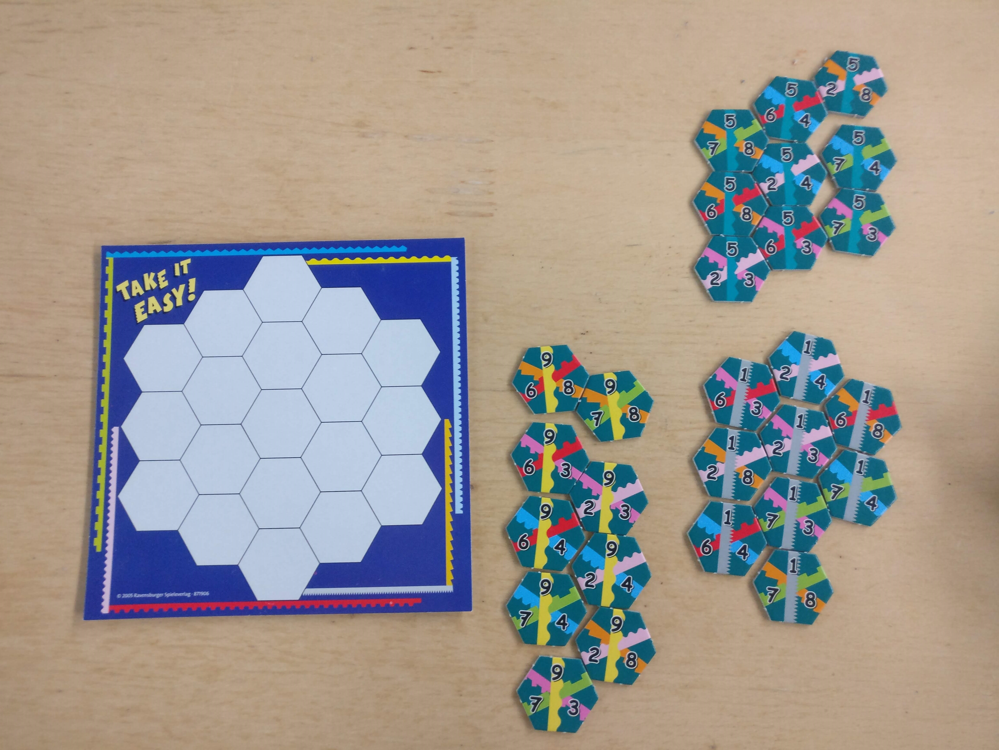
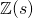
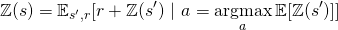
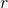
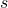
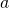
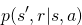

# An AI for the fun board game "Take it Easy" based on Reinforcement Learning
## Game description
Take it Easy is an abstract strategy board game for one to infinite players/AI's. 

Each player receives 27 hexagonal tiles and a board on which the tiles can be placed. 
Each tile has three lines on it, associated with a number from 1 to 9.

For each game step one player draws a tile randomly which every player places on his or her board.
In the end, the player receives points for each line he or she has completed (length of the line times the number associated with the line).
The player with the highest score wins the game. 



## Example
The example below shows exemplarily how a game could go. 


The final score is 
``
3*6 + 3*5 + 4*9 + 5*1 + 4*4 + 4*3 + 3*8 = 126
``
.

<div align="center"> </div>
 
# Installation
In order to try out this AI the following requirements need to be met:

```
python >= 3.5
numpy
torch
tqdm
tkinter
matplotlib
```

Clone the repository:
```
git clone https://github.com/polarbart/TakeItEasyAI
cd TakeItEasyAI
```

To try out the AI run `GUI.py`:
```
python GUI.py
```

To train the model on your own run `Trainer.py`:
```
python Trainer.py
```

If you have cython and a compiler you can compile the game which significantly speeds up training:
```
cythonize -i -3 TakeItEasyC.pyx
```

# Trivia

# Approach
This AI is based on reinforcement learning i.e. a policy is searched, that maximizes the expected future reward.

For each line the agent completes, she immediately receives the points as an reward (i.e. the length of the line times the number associated with the line).
Therefore the sum of her rewards equals the final score and the sum of expected future rewards is between 0 and 307. 

In order to find the policy a value based distributional approach is used, similar to [1].
I.e. a neural network predicts the distribution of  a random variable which represents the expected future reward.  is learned iteratively:
<div align="center"></div>
!!! reward in argmax !!!
Where  and  are random variables which depend on  and :  [2, formula 3.2].

 - state representation
 - network architecture
 - learning algorithm

# Results 

# References
[1] Marc G. Bellemare, Will Dabney: “A Distributional Perspective on Reinforcement Learning”, 2017; [arXiv:1707.06887](http://arxiv.org/abs/1707.06887).

[2] Richard S. Sutton, Andrew G. Barto: “Reinforcement Learning: An Introduction”, 2018; [MIT Press, Cambridge](http://incompleteideas.net/book/the-book-2nd.html).