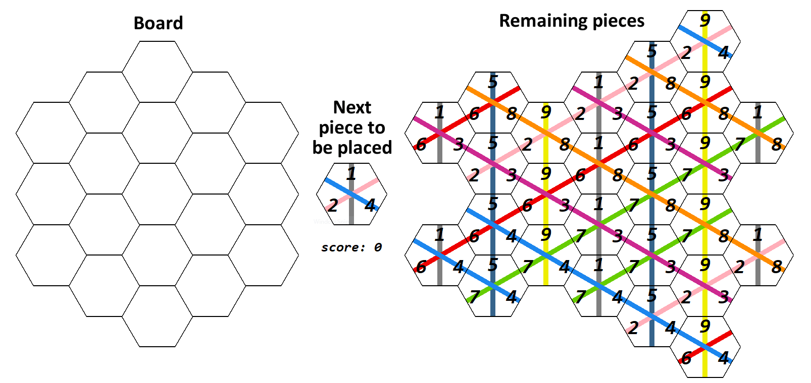

# Take It Easy AI

 - Based on distributional reinforcement learning [1]
 - The AI is as good as experienced Take It Easy players
 - For training, the game is simulated by a highly efficient C++ implementation

## Game description
[Take It Easy](https://en.wikipedia.org/wiki/Take_It_Easy_(game)) is an abstract strategy board game for one to infinite players/AI's. 

Each player receives 27 hexagonal **pieces** and a **board**. 
A board has 19 hexagonal **spaces** on which the pieces can be placed. 
Each piece has three line fractions on it, associated with a **number** from 1 to 9.

The game is played for 19 **steps**. For each step a piece is randomly selected, which every player then places on their board.
In the end, each player receives points for each **line** they have completed (length of the line times the number associated with the line).
The player with the highest number of points wins the game. 


### Example
The example below shows exemplarily how a game could go 
(thanks to [Quickblink](https://github.com/Quickblink) for the perfect arrangement of the pieces on the right). 



The final score is 
``
3*6 + 3*5 + 4*9 + 5*1 + 4*4 + 4*3 + 3*8 = 126
``
.

<div align="center"> </div>
 
## Approach
This AI is based on reinforcement learning i.e. a policy 
 
is learned that maximizes the points the player will receive.
 is the current state of the board and
 is the piece that should be placed on the board.

In order to find the policy, a value based distributional approach is used, similar to [1]. 
I. e. a neural network 
 
predicts the distribution of the random variable 
 
which represents the points a player will receive if they are in the state  
and they follow the policy .

The policy  can then be defined in terms of :

<div align="center"></div>

Where  is the current state of the board, 
 is the piece that should be placed on the board,
 is the space on which the piece will be placed,
 is the points the player receives if they complete a line
by placing  on , and 
 is the state of the board if 
 is placed on .

The network can be updated using a distributional version of the bellman equation:

<div align="center"></div>

Note that in this case  is a random variable. 
 is also the only source of randomness. 

The state of the board (i. e. the state ) is encoded in a 19x3x3 array 
where the first dimension identifies the space, 
the second dimension identifies the direction and the third dimension identifies the number using one hot encoding.

The network is a 4-layer fully connected neural network with 2048, 1024, and 512 hidden neurons and LeakyReLU activation functions. 
It takes the encoded board configuration as input and outputs a vector with 100 values representing the different quantiles 
(see [1] for more information on the encoding of the distribution).

For training, a dataset comprised of 16384 games is created on which the network is then trained for 8 epochs. 
This is repeated 150 times.
 
## Results 

 - The AI receives 167 points on average
 - The received points may range from 20 up to 300
 - The AI shows typical strategic behaviour e. g. it tends to place high scoring pieces on the outer lines of length 3 and 4 and uses the inner line of length 5 as 'trash line' i. e. it usually does not complete it.
 
The figure below shows a histogram of final received points. While the game certainly requires some strategic considerations, 
the histogram suggests that the received points also includes a significant amount of randomness.

<div align="center"> </div>

For comparison, [Quickblink](https://github.com/Quickblink) and I played 10 
games with the AI in order to figure out how well it performs. We both consider ourselves as experienced Take It Easy players.

The table below shows the received points for the 10 games. 
The games were played with the python implementation of Take It Easy and the seed `0`. 
The game logs can be found in the folder [game_logs](game_logs).

The experiments suggest that the AI is on par with experienced Take It Easy players. 
It won 5 out of the 10 games. Quickblink won 4 games and I won one game.
Quickblink has the best average score, closely followed by the AI. 

|       Game | [Quickblink](https://github.com/Quickblink) | polarbart |      AI |
|-----------:|--------------------------------------------:|----------:|--------:|
|          1 |                                         152 |       148 | **178** |
|          2 |                                         166 |       147 | **184** |
|          3 |                                         102 |        58 | **145** |
|          4 |                                         141 |       153 | **155** |
|          5 |                                     **189** |       106 |     165 |
|          6 |                                         174 |       153 | **180** |
|          7 |                                     **195** |       185 |     185 |
|          8 |                                     **227** |       140 |     171 |
|          9 |                                         169 |   **188** |     164 |
|         10 |                                     **185** |       167 |     139 |
| Mean score |                                     **170** |     144.5 |   166.6 |
|  Games won |                                           4 |         1 |   **5** |
 
## Installation
In order to try out this AI the following requirements need to be met:

```
python >= 3.5
numpy
pytorch
tqdm
tkinter
matplotlib
```

Clone the repository:
```
git clone https://github.com/polarbart/TakeItEasyAI
cd TakeItEasyAI
```

To try out the AI run [gui.py](gui.py):
```
python gui.py
```
If the gui is too large or too small you may adjust its size with the parameter `radius` which can be found at the end of [gui.py](gui.py).

In order to train the model by yourself, you first have to compile the C++ implementation of TakeItEasy 
which is roughly a gazillion times faster compared to the python implementation and therefore essential for training:
```
cd cpp
mkdir build
cd build
cmake ..
cmake --build . --config Release
```

Then you can train your model by running [trainer_distributional_quantile_regression.py](trainer_distributional_quantile_regression.py):
```
python trainer_distributional_quantile_regression.py
```
You might want to adjust the hyperparameters `n_games`, `batch_size_games`, and `data_device` 
depending on your amount of VRAM. I trained it on a NVIDIA Tesla V100 (16 GB VRAM) for roughly 7 hours.

## Some Trivia

 - The maximal number of points a player can receive is 307
 <!--- There are `27 choose 19 = 2,220,075` different final board configurations--->
 - There are `27*26* ... *8 = 270061246290137702400000 = 2.7e+23` possible final board configurations
 - Every **direction** is associated with three numbers
   - The vertical line has the numbers 1, 5, and 9
   - The line from top left to bottom right has the numbers 3, 4, and 8
   - The line from top right to bottom left has the numbers 2, 6, and 7
 - Every combination of numbers exists, that's why the game has `3*3*3=27` unique pieces
 

## References
[1] Dabney, Will, et al. "Distributional reinforcement learning with quantile regression." [arXiv:1710.10044](https://arxiv.org/abs/1710.10044) (2017).

[2] Richard S. Sutton, Andrew G. Barto: “Reinforcement Learning: An Introduction”, 2018; [MIT Press, Cambridge](http://incompleteideas.net/book/the-book-2nd.html).