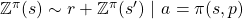

# TODO

 - Results 
 - Merge and Comment trainers
 - Comment Code
 - Trivia
 - Approach
 - Terminology
 


# An AI for the fun board game "Take it Easy" based on Reinforcement Learning
## Game description
Take it Easy is an abstract strategy board game for one to infinite players/AI's. 

Each player receives 27 hexagonal **pieces** and a **board**. 
The board has 19 hexagonal **tiles** on which the pieces can be placed. 
Each piece has three lines on it, associated with a **number** from 1 to 9.

The game is played for 19 **steps**. For each step one player draws a piece randomly which every player places on their board.
In the end, each player receives points for each **line** they have completed (length of the line times the number associated with the line).
At the end, the player with the highest number of points wins the game. 


## Example
The example below shows exemplarily how a game could go 
(thanks to [Quickblink](https://github.com/Quickblink) for the perfect arrangement of the tiles on the right). 


The final score is 
``
3*6 + 3*5 + 4*9 + 5*1 + 4*4 + 4*3 + 3*8 = 126
``
.

<div align="center"> </div>
 
# Installation
In order to try out this AI the following requirements need to be met:

```
python >= 3.5
numpy
pytorch
tqdm
tkinter
matplotlib
```

Clone the repository:
```
git clone https://github.com/polarbart/TakeItEasyAI
cd TakeItEasyAI
```

To try out the AI run [gui.py](gui.py):
```
python gui.py
```
If the gui is to large or to small you may adjust its size with the parameter `radius`.

In order to train the model by yourself, you first have to compile the C++ implementation of TakeItEasy 
which is roughly a gazillion times faster compared to the python implementation and therefore essential for training:
```
cd cpp
mkdir build
cd build
cmake ..
cmake --build . --config Release
```

Then you can train your model by running [trainer_distributional_quantile_regression.py](trainer_distributional_quantile_regression.py):
```
python trainer_distributional_quantile_regression.py
```
You might want to adjust the hyperparameters `n_games`, `batch_size_games`, and `data_device` 
depending on your amount of VRAM. I trained it on a NVIDIA Tesla V100 (16 GB VRAM) for roughly 7 hours.

# Trivia

 - The maximal number of points a player can receive is 307
 <!--- There are `27 choose 19 = 2,220,075` different final board configurations--->
 - There are `27*26* ... *8 = 270061246290137702400000 = 2.7e+23` possible final board configurations
 - Every **direction** is associated with three numbers
   - The vertical line has the numbers 1, 5, and 9
   - The line from top left to bottom right has the numbers 3, 4, and 8
   - The line from top right to bottom left has the numbers 2, 6, and 7
 - Every combination of numbers exists, that's why the game has `3*3*3=27` unique pieces
 
 
# Approach
This AI is based on reinforcement learning i.e. a policy 
 
is learned that maximizes the points the player will receive.
 is the current configuration of the board and
 is the piece that should be placed on the board.

In order to find the policy, a value based distributional approach is used, similar to [1]. 
I. e. a neural network 
 
predicts the distribution of the random variable 
 
which represents the points a player will receive if they are in the state  
 
and they follow the policy  .

The policy  can then be defined in terms of :

<div align="center"></div>

Where  is the current configuration of the board, 
 is the piece that should be placed on the board,
 is the tile where the piece should be placed,
 is the points the player receives if they finish a line, and 
 is the configuration of the board if 
piece  is placed on the specified tile.

The network can be updated using a distributional version of the bellman equation:

<div align="center"></div>

Note that in this case  is a random variable. 
 is also the only source of randomness. 

The configuration of the board (i. e. the state ) is encoded in a 19x3x3 vector 
where the first dimension identifies the tile, 
the second dimension identifies the direction and the third dimension identifies the number using one hot encoding.

The network is a 4-layer fully connected neural network with 2048, 1024, and 512 hidden neurons and LeakyReLU activation functions. 
It takes the encoded board configuration as input and outputs a vector with 100 values representing the different quantiles 
(see [1] for more information on the encoding of the distribution).

For training, first a dataset comprised of 16384 games is created on which the network is trained for 8 epochs. This is repeated 150 times.

# Results 

 - The learned policy receives on average 167 points
 - The received points may range from 40 to 270 
 - The policy tents to place the good numbers  on the outer lines of length 3 and 4 and uses the inner line of length 5 as 'trash line' i. e. it usually does not complete it.

# References
[1] Dabney, Will, et al. "Distributional reinforcement learning with quantile regression." [arXiv:1710.10044](https://arxiv.org/abs/1710.10044) (2017).

[2] Richard S. Sutton, Andrew G. Barto: “Reinforcement Learning: An Introduction”, 2018; [MIT Press, Cambridge](http://incompleteideas.net/book/the-book-2nd.html).