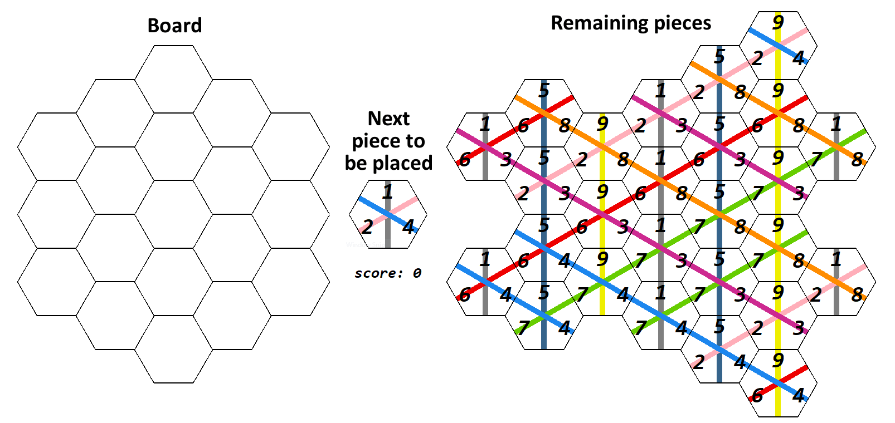

## Log Files

A log file lists played pieces and their position for each game step.

The spaces are numbered from top to bottom and from left to right.

```
        7
    3      12
 0      8      16
    4      13
 1      9      17
    5      14
 2     10      18
    6      15
       11
```

The example from the main page would have the following log.



```
9, [1, 2, 4]
11, [1, 7, 8]
12, [5, 7, 8]
5, [9, 2, 3]
7, [1, 6, 8]
2, [5, 2, 8]
8, [1, 7, 4]
0, [5, 6, 8]
17, [5, 6, 4]
13, [9, 2, 4]
10, [1, 2, 3]
1, [5, 7, 3]
15, [1, 7, 3]
3, [9, 6, 4]
6, [9, 7, 8]
4, [9, 6, 3]
14, [5, 6, 3]
18, [1, 6, 3]
16, [5, 7, 4]

``` 